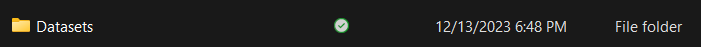
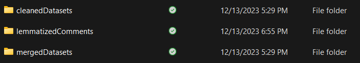

# Data Cleaning Project - DSC200

## Overview

Team membership: Brandon, Nathan, Abhishek

### Project Description

Company A is a stainless-steel manufacturing company. The company has one plant in north
America with several production lines that produce stainless steel in many different forms. The project
described below is geared towards improving two of their many business
processes. For each of these projects, the goal is to design and build a simple Python
application for collecting and preprocessing (cleaning, preparing, etc.) the data for future data
analytics work.

### Deadlines:

1. Form and join a Canvas Project Group – November 16, 2023
2. Select one of the projects – November 16, 2023
3. GitHub repository created for report and code – November 23, 2023 (saadjei)
4. Project Report. The details of the report will be provided in due course – Final Exam Day
5. Project Code – Final Exam Day
6. Presentation of the project – Final exam day. ( the ppt presentation) The client will be
present. Evaluation of the work (peer review as well as one from the client)

## Project

This project elates to the collection of production flaws, etc. that may be observed from three
possible sources:

1. An automated system that identifies flaws in production,
2. Flaws identified by employees that oversee/man the production lines or
3. Claims from customers to whom products have been delivered.
DSC200 Fall 2023 Final Project
Company A has provided our class section with a set of structured data sets in some 6
difference CSV files, each of which contains anonymized data which will be required for this
task. Note that as a result of client consultation the number of datasets might change.

Your task is to build a modularized Python application that performs the following tasks:

1. Consolidate the datasets into a fewer set of tables
2. Perform all the cleaning tasks that were discussed in class including, but not limited to
the following:
a. Deduplication
b. Anomaly detection and correction
c. Dealing with missing data, data inconsistency, etc.
3. Uploading the cleaned data to a designated database. (See the instructor for access to
your team’s database)

What to submit:

1. A Completed Report, the contents of which will be provided in due course
2. A python script containing the application discussed above. The file format and naming
structure will be provided in due course.
3. PowerPoint presentation for the final presentation
4. A peer review of the other teams; work. This will be due after each presentation. The
rubric will be provided in due course

## Configuration

### Datasets

The datasets required for this program were provided by Stainless Steel Company X. The 
datasets must be included in a folder named Datasets that should be created in the project 
folder.

The datasets must be named exactly as they are named in the program and must contain all the
same columns and data types/sizes.

### Configuration File

In order to connect to the database you will need to create a file named db.conf. This file
should contain the following section and information:

[db]
url=your_db_servers_ip_address
database=your_database_name
dbuser=your_database_user
dbpassword=your_database_password
port=your_port

The resulting cleaned, merged, and lemmatized datasets can be found in the folders 
cleanedDatasets, mergedDatasets, and lemmatizedComments respectivly.

